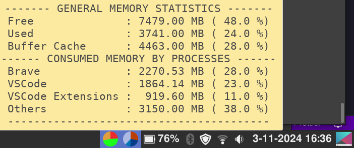

# 🌟 My Memory Monitor




### 📖 Description

**My Memory Monitor** is an applet for Linux Mint that displays the system's cache memory usage in real-time on the panel. It is useful for monitoring memory usage directly from your desktop without the need to open any other monitoring tools.

### 🌈 Features

-   ⏱️ **Real-time memory monitoring**: Shows the amount of cache memory used on your system.
-   🔄 **Customizable refresh rate**: Allows you to set how frequently the applet updates the memory information.
-   📊 **Visual indicator**: Displays memory usage with graphical elements, such as pie charts or progress bars (if applicable).
-   💬 **Tooltip information**: Provides detailed memory statistics on hover.

### 📥 Installation

1. **Download the Applet**: Clone or download this repository to your local machine.

    ```bash
    git clone https://github.com/LucasJappert/memory-monitor-applet
    ```

2. **Move to Applets Folder**: Copy the applet folder to your Cinnamon applets directory.

    ```bash
    cp -r memory-monitor-applet ~/.local/share/cinnamon/applets/
    ```

3. **Add the Applet**:

    - Right-click on your panel in Linux Mint and select **"Applets"**.
    - Find **"My Memory Monitor"** in the list and click **Add** to activate it.

4. **Configure the Applet**: You can configure the update interval and other settings through the applet’s preferences menu (if applicable).

### 🛠️ Usage

Once installed and activated, the applet will start displaying the cache memory usage in real-time. Hover over the applet to see additional memory details.

### 📋 Requirements

-   **Linux Mint** with the Cinnamon desktop environment.
-   No additional dependencies are required for the basic functionality.

### ⚙️ Configuration (Optional)

If your applet includes additional configuration options, describe them here. For example:

-   ⏳ **Refresh Rate**: Set the interval at which memory usage is updated.
-   🔍 **Custom Process Monitoring**: Specify certain processes to monitor individually.

### 🐞 Troubleshooting

-   ❌ **Applet Not Updating**: Ensure you have the correct permissions and that the applet is installed in the correct directory.
-   ⚠️ **High Memory Usage**: Adjust the refresh rate to a longer interval if you experience performance issues.
-   📜 **Logging**: Check `~/.xsession-errors` or use **Looking Glass** (`Alt + F2`, type `lg`) to view logs for debugging.

### 🤝 Contributing

We welcome contributions to improve **My Memory Monitor**! If you have ideas for new features, optimizations, or bug fixes, please feel free to submit a pull request or open an issue on the [GitHub repository](https://github.com/LucasJappert/memory-monitor-applet). Let's work together to make this applet even better for the Linux Mint community!

### 📄 License

This project is licensed under the MIT License - see the [LICENSE](LICENSE) file for details.

MIT License

Copyright (c) 2024 Lucas Jappert

Permission is hereby granted, free of charge, to any person obtaining a copy
of this software and associated documentation files (the "Software"), to deal
in the Software without restriction, including without limitation the rights
to use, copy, modify, merge, publish, distribute, sublicense, and/or sell
copies of the Software, and to permit persons to whom the Software is
furnished to do so, subject to the following conditions:

The above copyright notice and this permission notice shall be included in all
copies or substantial portions of the Software.

THE SOFTWARE IS PROVIDED "AS IS", WITHOUT WARRANTY OF ANY KIND, EXPRESS OR
IMPLIED, INCLUDING BUT NOT LIMITED TO THE WARRANTIES OF MERCHANTABILITY,
FITNESS FOR A PARTICULAR PURPOSE AND NONINFRINGEMENT. IN NO EVENT SHALL THE
AUTHORS OR COPYRIGHT HOLDERS BE LIABLE FOR ANY CLAIM, DAMAGES OR OTHER
LIABILITY, WHETHER IN AN ACTION OF CONTRACT, TORT OR OTHERWISE, ARISING FROM,
OUT OF OR IN CONNECTION WITH THE SOFTWARE OR THE USE OR OTHER DEALINGS IN THE
SOFTWARE.

### 🙏 Acknowledgments

Special thanks to the Linux Mint and Cinnamon development communities for their excellent documentation and support.
